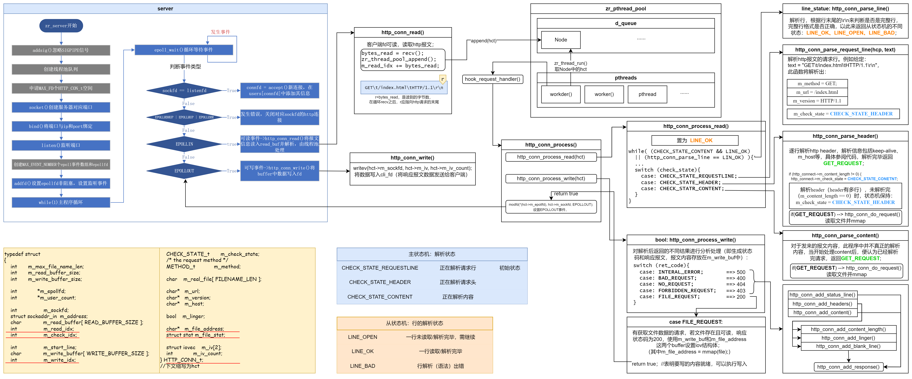

## 前置基础

### http报文

在HTTP报文中，请求行和消息头是两个主要的组成部分。

**请求行（Request Line）**：位于HTTP请求报文的第一行，用于描述客户端请求的类型、目标URL和使用的协议版本。请求行由三个字段组成：请求方法、请求目标和协议版本。
下面是请求行的格式：
```
请求方法 请求目标 协议版本
```

常用的请求方法包括：
- GET：获取资源
- POST：提交数据
- PUT：更新资源
- DELETE：删除资源
- HEAD：获取资源的元信息
- OPTIONS：获取服务器支持的方法

请求目标是指请求的URL或URI，用于标识服务器上的资源。

协议版本指定了请求使用的HTTP协议版本，例如HTTP/1.1。

**消息头（Header）**：位于请求行之后，每个消息头占据一行，包含一个字段名和一个字段值，用冒号分隔。消息头用于传递关于请求的附加信息，如请求的主机、内容类型、用户代理等。消息头可以有多个，并以空行结束。

以下是一个示例HTTP请求报文的请求行和消息头部分：

```
GET /example HTTP/1.1
Host: www.example.com
User-Agent: Mozilla/5.0 (Windows NT 10.0; Win64; x64) AppleWebKit/537.36 (KHTML, like Gecko) Chrome/91.0.4472.124 Safari/537.36
Accept: text/html,application/xhtml+xml,application/xml;q=0.9,image/webp,image/apng,*/*;q=0.8,application/signed-exchange;v=b3;q=0.9
```

在这个例子中，请求行是`GET /example HTTP/1.1`，消息头包括`Host`、`User-Agent`和`Accept`等字段。


## Http Parse

整体流程如下图，按照箭头顺序阅读：



下面介绍http parse相关流程。

### http_conn_read()

新连接到来且有数据可读（EPOLLIN事件）时，调用此函数。使用recv循环读取数据，存放到 hct 结构体的m_read_buffer中，报文读取完毕后，将hct加入到线程池的队列中，等待线程池工作队列解析。


### http_conn_process()

当线程池队列中有元素待解析时，线程池worker()会取该元素，调用次函数进行http parse；

该函数是处理http报文的重要函数，通过调用子函数最终完成读取、解析、写入、发送等功能。

#### HTTP_CODE_t: http_conn_preocess_read()

该函数实现了一个表示当前解析状态的状态机，

```c
while ( ((http_connect->m_check_state == CHECK_STATE_CONETNT) && (line_status == LINE_OK)) 
            || ( (line_status = http_conn_parse_line(http_connect)) == LINE_OK ) ) {
        text = http_conn_get_line(http_connect);     
        http_connect->m_start_line = http_connect->m_check_idx;
		switch (http_connect->m_check_state) {
        case CHECK_STATE_REQUESTLINE: {
            ret = http_conn_parse_request_line(http_connect, text);
            if (ret == BAD_REQUEST) {
                return BAD_REQUEST;
            }
            break;
        }
        case CHECK_STATE_HEADER: {
            ret = http_conn_parse_header(http_connect, text);
            if (ret == BAD_REQUEST) {
                return BAD_REQUEST;
            }
            else if (ret == GET_REQUEST) {
                return http_conn_do_request(http_connect);
            }
            break;
        }
        case CHECK_STATE_CONETNT: {
            ret = http_conn_parse_content(http_connect, text);
            if (ret == GET_REQUEST) {
                return http_conn_do_request(http_connect);
            }
            line_status = LINE_OPEN;
            break;
        }
        default: {
            return INTERAL_ERROR;
        }
    }
}
```

**状态机状态分析**

* 进入while前，为初始状态：`CHECK_STATE_REQUESTLINE`：
    * 当`http_conn_parse_line(http_connect)) == LINE_OK`时进入分支`case CHECK_STATE_REQUESTLINE:`，开始解析请求行`http_conn_parse_request_line()`；
    * 函数`http_conn_parse_request_line()`解析完毕后，切换状态机状态为：`CHECK_STATE_HEADER`;
* 无return，再次进入while，此时状态：`CHECK_STATE_HEADER`：
    * 当`http_conn_parse_line(http_connect)) == LINE_OK`时进入分支`case CHECK_STATE_HEADER`，解析请求头`http_conn_parse_header()`，逐行解析:
        * 若有content，切换状态`CHECK_STATE_CONTENT`，`ret = NO_REQUEST`，若未读完设置`LINE_OPEN`，读完设置`LINE_OK`;
        * 若无content，`ret =  GET_REQUEST`;
    * `if(ret == GET_REQUEST)`，则调用`http_conn_do_request()`处理请求的文件（将文件内容映射mmap到内存中，将地址保存在`m_file_address`），`return FILE_REQUEST`;
* 无return，再次while，此时状态：`CHECK_STATE_CONTENT`，`LINE_OPEN`:
    * 当`http_conn_parse_line(http_connect)) == LINE_OK`时进入分支`case CHECK_STATE_CONETNT`，调用函数`http_conn_parse_content()`，在此函数中，如果当前正在读取content，则表明request以及读取完毕且无错误，则直接`ret = GET_REUQEST`（忽略content的具体内容，此程序中不做解析）；
    * `if(ret == GET_REQUEST)`，则调用`http_conn_do_request()`处理请求的文件（将文件内容映射mmap到内存中，将地址保存在`m_file_address`），`return FILE_REQUEST`;

上述函数返回解析结果`HTTP_CODE_t`，根据结果执行`bool http_conn_process_write()`:

#### bool: http_conn_process_write()

```c
bool http_conn_process_write(HTTP_CONN_t *hct, HTTP_CODE_t ret)
{
    switch( ret ) {
        case INTERAL_ERROR: ...
        case BAD_REQUEST: ...
        case NO_REQUEST: ...
        case FORBIDDEN_REQUEST: ...
        case FILE_REQUEST: {
            /* The file request need to be handled specifically. */
            http_conn_add_status_line(hct, 200, ok_200_title);

            if (hct->m_file_stat.st_size != 0) {
                http_conn_add_headers(hct, hct->m_file_stat.st_size);
                hct->m_iv[0].iov_base = hct->m_write_buffer;
                hct->m_iv[0].iov_len = hct->m_write_idx;
                hct->m_iv[1].iov_base = hct->m_file_address;
                hct->m_iv[1].iov_len = hct->m_file_stat.st_size;
                hct->m_iv_count = 2;

                return true;
            }
            else {
                const char *ok_string = "<html><body></body></html>";
                http_conn_add_headers(hct, strlen(ok_string));
                if ( !http_conn_add_content(hct, ok_string)) {
                    return false;
                }
            }
            break;
        }
        default: {
            return false;
        }
    }
    hct->m_iv[0].iov_base = hct->m_write_buffer;
    hct->m_iv[0].iov_len = hct->m_write_idx;
    hct->m_iv_count = 2;

    return true;
}
```

该函数根据报文解析结果`ret`，生成对应的响应报文，包括“状态码、状态信息，响应信息等”；

其中若请求文件需要额外处理，与其它响应报文不同的是还需要额外写入（发送）文件数据，使用`writev`写多个buffer；

当将所有需要发送的内容写入`m_write_buf`之后(文件直接从映射的内存中读取)，调用`modfd`函数设置`EPOLLOUT`事件，进行数据发送；


## 其它

一些字符串分析的源码，其中细节较多，扔给AI进行解释。

### http_conn_parse_request_line()

**AI解析**

这段代码实现了一个HTTP请求行的解析函数，将输入的HTTP请求行进行解析，并将解析结果存储到HTTP_CONN_t结构体中。下面是函数的具体实现：

1. 首先从输入的text中找到第一个出现的空格或制表符的位置，将其作为m_url的分隔位置，即m_url指向空格或制表符的位置。
2. 如果没有找到m_url的分隔位置，返回BAD_REQUEST。
3. 将m_url的分隔位置的字符设置为'\0'。这个操作的效果是将text的字符串分成两部分，第一部分是method，第二部分是m_url。
4. 将method指针指向text，使用strcasecmp函数比较method是否为"GET"，如果是，将m_method设置为GET，否则返回BAD_REQUEST。
5. 将m_url指向下一个非空格和非制表符的位置。
6. 从m_url中找到第一个出现的空格或制表符的位置，将其设置为'\0'。这个操作的效果是将m_url分成两部分，第一部分是URL，第二部分是HTTP版本号。
7. 将HTTP版本号的指针指向下一个非制表符的位置。
8. 使用strcasecmp函数比较HTTP版本号是否为"HTTP/1.1"，如果不是，返回BAD_REQUEST。
9. 如果URL以`"http://"开头，将m_url指向URL中的第一个"/"的位置。`
10. 如果m_url为空或第一个字符不是'/'，返回BAD_REQUEST。
11. 将m_check_state设置为CHECK_STATE_HEADER。
12. 返回NO_REQUEST表示解析成功。


### http_conn_parse_line()

**AI解析**

这段代码是一个解析HTTP请求报文中的一行数据的函数。函数的返回值是一个枚举类型LINE_STATUS_t，表示解析的结果。
函数首先定义了一个临时变量temp用于存储当前遍历到的字符。

然后通过一个for循环遍历http_connect->m_read_buffer中的字符，循环条件是http_connect->m_check_idx小于http_connect->m_read_idx。

在循环内部，先将当前遍历到的字符赋值给temp，然后根据字符的不同进行不同的处理。

如果temp等于'\r'，表示遇到了回车符。接下来判断下一个字符是否为换行符'\n'，如果是，则表示成功解析了一行数据，将m_check_idx的值加2，即跳过回车和换行符，然后返回LINE_OK；如果下一个字符不是换行符，则返回LINE_BAD。

如果temp等于'\n'，表示遇到了换行符。接下来判断前一个字符是否为回车符'\r'，如果是，则表示成功解析了一行数据，将m_check_idx的值加2，即跳过回车和换行符，然后返回LINE_OK；如果前一个字符不是回车符，则返回LINE_BAD。

如果以上条件都不满足，则继续循环遍历下一个字符。

如果循环结束，还没有遇到回车符和换行符，表示还没有解析完一行数据，返回LINE_OPEN。

总结：这段代码通过遍历字符数组来解析HTTP请求报文中的一行数据，根据回车符和换行符的位置来判断是否解析成功，并返回相应的结果。