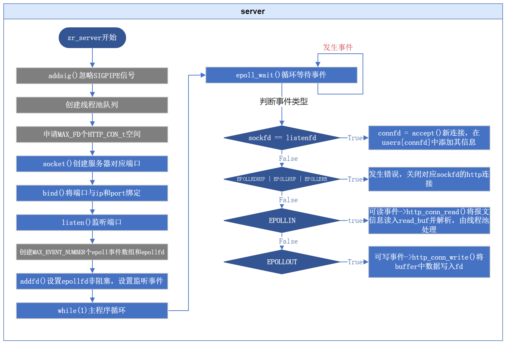

## server 服务器主程序 

主程序中当然会调用很多其他文件中的功能函数或者结构体定义，初看此工程只需要知道对应功能即可，不必去深追代码，必要的功能会设置跳转链接；

### 简介

文件：`server.c server.h`；
功能：服务器启动的主程序；

### 流程图



**Notes：**

* 右侧线程池相关处理过程后面在详细展开；
* 使用了Reactor模型，参考游双P128；

### main()

没什么好说的，主要提一下zr_printf的用法；🤣

### zr_server()

服务器功能函数；

注意参数 ip 和 port 都是字符串；

从上往下看源码：

#### 设置忽略信号

粗略说一下：在linux中，系统对很对很多信号的默认处理方式都是终止发出信号的程序，网络服务器当然不能因为客户端关闭信号或者对端管道关闭等信号就被系统杀死，所以需要设置这些信号的处理方式；

##### addsig() 设置信号处理方式

该程序中使用此函数忽略SIGPIPE函数；

```c
/* ignore the SIGPIPE */
addsig( SIGPIPE, SIG_IGN, true);
```

函数源码：

```c
/* is_start default is true */
void addsig(int sig, void(handler)(int), bool is_restart)
{
    struct sigaction sa;
    memset(&sa, '\0', sizeof(sa));
    sa.sa_handler = handler;
    if (is_restart) {
        sa.sa_flags |= SA_RESTART;
    }
    /* Add all signal to mask, dont use signal`s default handle method */
    sigfillset(&sa.sa_mask);
    assert(sigaction(sig, &sa, NULL) != -1);
}
```

**Notes：**

* sigaction以及相关函数，是书本中的知识，自行百度；
* `SA_RESTART`：信号触发时，要去调用对应信号处理函数，可能会中断一些其他系统调用；如果对此信号设置了SA_RESTART，则因此信号中断的系统调用会自动重启（而不是被中断或返回错误）；
* `sigfillset(&sa.sa_mask);`：使用 `sigfillset` 函数将 `sa_mask` 成员设置为一个包含所有信号的信号集；在此sig信号在处理时，`sa_mask`中指定的信号将被阻塞，以防止干扰对sig信号的处理（例如避免产生嵌套的信号调用？）；
* line12中`sigaction(sig, &sa, NULL)`将sig与sa绑定起来；


#### linger延迟关闭sockfd

为了应对在关闭套接字时有数据未发送完毕的情况，可以设置套接字延迟关闭；

```c
    struct linger tmp = { 1, 0 };   //打开延迟关闭开关，但是时间设置为0，也就是说不延迟
    setsockopt(listenfd, SOL_SOCKET, SO_LINGER, &tmp, sizeof(tmp));
```

`struct linger` 结构表示套接字的延迟关闭行为。它具有两个成员变量：

* `l_onoff`：指定是否启用延迟关闭。如果将其设置为非零值（在这里是1），则启用延迟关闭；如果设置为0，则禁用延迟关闭。
* `l_linger`：指定延迟关闭的时间。如果 `l_onoff` 被设置为非零值，那么 `l_linger` 设置了延迟关闭的时间（以秒为单位）。

**Notes：**此程序中打开了延迟开关，但是未设置延迟（以后若有需要，可以自行设置）；


#### 空间换时间思想应用

预先分配好空间来提升响应速度，主要有以下几个地方使用：

##### users

```c
#define MAX_FD							65535
HTTP_CONN_t *users = (HTTP_CONN_t *)malloc(sizeof(HTTP_CONN_t) * MAX_FD); 
```

直接分配了等同于最大fd个数的users空间，每个user对应于一个HTTP_CONN_t类型的对象（其中是包含了各自的读写buf等各种属性）；

同时也因为有MAX_FD个，假设有新连接且其socket为connfd，可以直接将其存入users[connfd]，也就可以直接使用users[connfd]索引该连接；

##### zr_thread_pool_create()中线程数组

```c
//zr_thread_pool.c
ztp->m_threads = (pthread_t *)malloc(sizeof(pthread_t) * ztp->m_thread_number);
```


#### epoll

epoll的基础知识不做赘述，建议看书（不建议百度，因为网络知识很碎片很碎片化且质量普遍不高）。

epoll编程主要框架：

```c
/***** 1.创建epoll实例 *****/
struct epoll_event events[ MAX_EVENT_NUMBER ];	/* 事件数组，当事件发生时会被系统添加到此数组中 */
epollfd = epoll_create(5);							/* 创建epoll实例 */
assert(epollfd != 0);

/***** 2.设置事件 *****/
/* 绑定epollfd与listenfd，设置监听事件 */
struct epoll_event event;
event.data.fd = fd;											/* 设置关联的fd */
event.events = EPOLLIN | EPOLLRDHUP;		/* 设置事件，EPOLLRDHUP为对端或连接关闭事件 */
event.events |= EPOLLET;								/* 设置边沿触发 */
epoll_ctl(epollfd, EPOLL_CTL_ADD, fd, &event);
setnoblock(fd);													/* 设置非阻塞 */

/***** 3.等待事件 *****/
/* 通常放到while中 */
while (true) {
    /* 发生的事件数量（事件被添加到events数组中） */
    int number = epoll_wait(epollfd, events, MAX_EVENT_NUMBER, -1);
    if ((number < -1) && (errno != EINTR)) {
				//...
        break;
    }
		/***** 4.处理就绪的事件 *****/
    for (int i = 0; i < number; ++i) {
        int sockfd = events[i].data.fd;
        /* 常见一些事件 */
      	/* 服务器绑定的listenfd上发生事件，表示有新连接 */
        if (sockfd == listenfd) {
						//...接收新客户端连接的操作...
          	//accept()...
        }
        /* New event come but err. */
        else if ( events[i].events & (EPOLLRDHUP | EPOLLHUP | EPOLLERR) ) {
						//发生错误，关闭fd对应连接的操作...
        }
        /* fd有可读事件 */
        else if ( events[i].events & EPOLLIN ) {
						//从fd读取数据的操作
        }
        /* fd有可写事件 */
        else if ( events[i].events & EPOLLOUT ) {
						//将数据写入fd的操作
        }
        else {
						//other...
        }
    }
}

/***** 附.若连接断开，删除fd对应事件 *****/
epoll_ctl(epollfd, EPOLL_CTL_DEL, fd, 0);
/***** 附.针对数据读写情况，修改事件 *****/
epoll_ctl(epollfd, EPOLL_CTL_MOD, fd, &event);
```

**Notes：**

* 此处初始化时只设置EPOLLIN事件读取http请求报文；
* 当有线程获取到http报文的处理任务时，才会给对应fd设置EPOLLOUT时间，以往fd中写入数据；


### 总结

以上就是主程序的大致流程，主要工作就是众所周知的网络编程流程、初始化或预先分配一下空间、设置epoll等，关键在于对事件的处理，详情参考http_conn解析文档；
