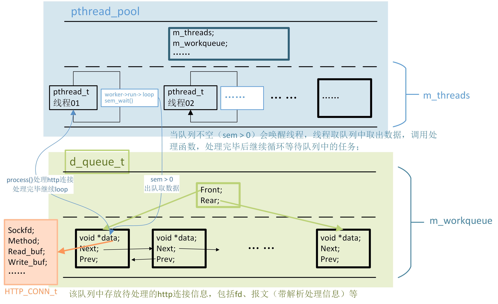

## zr_thread_pool-线程池实现



（PS：此图画的比较早，比较抽象，后续再优化...😃）


主要有以下几点：

* 如何使用双向队列，注意其中数据类型的转换以及地址传递；
* 线程池的实现也是通用的，如果要使用该线程池，要求如下：
    * 两对源和头文件：zr_thread_pool和zr_ds；至于zr_util，就使用了zr_printf()函数，可用也可不用（自己调整一下即可）；
* 锁和信号量的使用；


### zr_thread_pool.h 头文件

```c
typedef struct {
    int m_thread_number;    /* the num of threads */
    int m_max_request;      /* the max num of request queue (thread array) */
    pthread_t *m_threads;   /* the pointer of thread array */
    D_QUEUE_t *m_workqueue; /* the request queue */
    bool m_stop;            /* if stop the thread */     
    /* ptherad_mutex, protect the work_queue */
    pthread_mutex_t m_workqueue_locker;
    /* sem, determind if there is work needs to be processed */
    sem_t m_workqueue_sem;
} ZR_THREAD_POOL_t;

/* Return a  thread_pool with thread_number, max_request; */
ZR_THREAD_POOL_t *zr_thread_pool_create(int thread_number, int max_request);
void zr_thread_pool_destory(ZR_THREAD_POOL_t *ztp);
bool zr_thread_pool_append(ZR_THREAD_POOL_t *ztp, void *data);

/* The func used in pthread_create, the fixed formatting, 
 * the return could be NULL or anything */
void *worker(void *arg);
/* Pop a thread and let it working. */
void zr_thread_pool_run(ZR_THREAD_POOL_t *ztp);
/* handnle the data in Node. */
void hook_request_handler(struct Node *request);
```

**Notes：**

* `m_threads`存放所有线程的数组；
* `m_workqueue`用来存放待执行的任务，待执行个数==信号量，任务中有待执行任务时，会有信号量通知程序分配一个空闲线程来处理此任务；
* 注意线程池结构体中包括互斥锁和信号量：
    * 互斥锁用来保证对线程池中队列的互斥访问；
    * 信号量表示当前队列中待处理的任务；

* `void *worker(void *arg);`是线程创建时传入的函数（线程会调用的函数），固定格式；
* `void zr_thread_pool_run(ZR_THREAD_POOL_t *ztp);`
* `void hook_request_handler(struct Node *request);`


### zr_thread_pool.c 接口实现

#### 队列中data类型定义

```c
//必须定义，队列中存放的数据类型
#define DATA_TYPE HTTP_CONN_t
```

用于对队列Node中`void *data`类型的转换（因为仅在此.c文件中使用，就不放到头文件中了）；


#### zr_thread_pool_create()-创建线程池

```c
ZR_THREAD_POOL_t *zr_thread_pool_create(int thread_number, int max_request)
{
		//...
		//实例化线程池（结构体）
    ZR_THREAD_POOL_t *ztp = (ZR_THREAD_POOL_t *)malloc(sizeof(ZR_THREAD_POOL_t));
		//...
    /* create the workqueue */
    ztp->m_workqueue = d_queue_create();
    /* init the mutex locker */
    pthread_mutex_init(&(ztp->m_workqueue_locker), NULL);
    /* Malloc the mem of thread`s array */
    ztp->m_threads = (pthread_t *)malloc(sizeof(pthread_t) * ztp->m_thread_number);
		//...
    /* Create thread_number threads and set all detach */
    for (int i = 0; i < ztp->m_thread_number; ++i) {
        if (pthread_create(ztp->m_threads + i, NULL, worker, ztp) != 0) {
            /* create false */
            free(ztp->m_threads);
        }
        /* Set detach. The thread will auto free after run over in state detach */
        if (pthread_detach(ztp->m_threads[i])) {
            free(ztp->m_threads);
        }
    }

    return ztp;
}
```

**Notes：**

* 注意互斥锁是需要初始化的；
* `pthread_create(ztp->m_threads + i, NULL, worker, ztp)`创建线程且设置线程的执行地址从worker函数开始； #TODO
* `pthread_detach(ztp->m_threads[i])`将线程于主控线程分离，使其独立执行，且执行完自行释放资源；注：此程序中线程都是while(1)中的，不会结束；


#### worker()

主要是运行线程；

```c
void *worker(void *arg)
{
    ZR_THREAD_POOL_t *ztp = (ZR_THREAD_POOL_t *)arg; 
    zr_thread_pool_run(ztp);

    return ztp;
}
```


##### zr_thread_pool_run()

```c
void zr_thread_pool_run(ZR_THREAD_POOL_t *ztp)
{
    while ( !ztp->m_stop ) {
        /* wait the sem, then first lock */
        ZR_SEM_WAIT(ztp->m_workqueue_sem);
        ZR_LOCK(ztp->m_workqueue_locker);
        
        if (d_queue_is_empty(ztp->m_workqueue)) {
            /* No queue, unlock */
            ZR_UNLOCK(ztp->m_workqueue_locker);
            continue;
        }
        /* The Node in workqueue, it should include some data
         * Get the front node in queue.
         */
        struct Node *request_node;
        /* If we want to modify the val of request_node(its a pointer), add '&' */
        d_queue_pop_front(ztp->m_workqueue, &request_node);

        /* unlock */
        ZR_UNLOCK(ztp->m_workqueue_locker);

        if ( !request_node ) {
            continue;
        }

        hook_request_handler(request_node);
    }
}
```

**Notes：**

* 线程的主要工作就是不停循环的从队列中取任务进行处理；
* 使用了信号量机制使得无任务时线程休眠，信号量>0时唤醒线程，线程去队列中取需要处理的数据，然后调用处理函数；
* ` hook_request_handler(request_node)`是处理node中数据的函数，该函数起一个过渡作用，转换request_node的类型，然后调用`http_conn_process()`取真正的处理http请求；


#####  hook_request_handler(request_node)

```c
void hook_request_handler(struct Node *request)
{
    /* 检查DATA_TYPE是否定义 */
#ifndef DATA_TYPE
    zr_printf(ERROR, "Please define the DATA_TYPE at the begining of this file!");
    return;
#endif

    /* Handle the request. */
    http_conn_process((DATA_TYPE *)(request->data));
}
```

**Notes：**

* `DATA_TYPE`必须定义；
* `http_conn_process((DATA_TYPE *)(request->data));`函数放到http_conn文档中说明；


