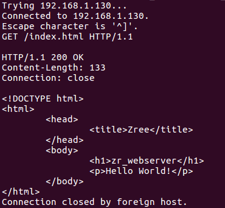
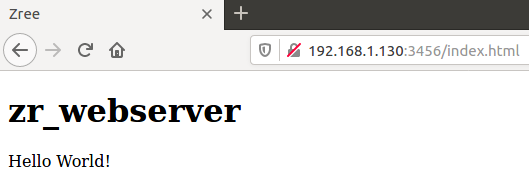

## 简介

```
├─cgi			# 未实现
├─docs		# 文档和流程图	
├─http    # http解析源码
├─io      # io相关源码
├─server  # 服务器主程序源码
├─thread_pool		# 线程池实现源码
├─util		# 一些工具函数源码
└─Makefile	# $ make 可编译工程
```

参考游双《高性能服务器编程》实现的简单webserver，游双书中是C++版本，这里使用纯C语言实现，其中对于各种指针的运用，看起来简单，一试便出问题，整体写下来很提高C语言以及逻辑思维能力。并且整体项目难度不大，适合作为练习C语言、以及linux高级编程的入门练手项目；

**本项目知识点**：

* **提供详细的解释文档以及http_parse的流程图；**
* 主程序采用epoll非阻塞IO监听事件，采用统一事件源思想；
* 从零实现基于双向队列的线程池，读写事件发生时，由主程序将对应连接数据append入线程池，然后由线程异步自动处理；
* http消息解析采用主从状态机的架构，主状态机负责行解析状态的切换，从状态机负责解析每一行的数据，返回对应行状态；采用了字符指针异步读取数据的方法，性能较好；
* 处理GET请求文件使用mmap内存映射，使用writev来同时向客户fd写入应到报文和文件内容；
* 通用的Makefile框架；

## 使用

1. 设置server默认路径和`index.html`文件（用于测试），修改`http_conn.h`中的`doc_root`变量：

```c
/* 以下为默认路径，存放网站源码（修改为自定义的网站源码路径） */
const char *doc_root = "/home/zhai/www/html"
```

2. 如果你没网站源码，可使用如下`index.html`源码，放到上述路径下`/home/zhai/www/html/index.html`：

```html
<!DOCTYPE html>
<html>
	<head>
		<title>Zree</title>
	</head>
	<body>
		<h1>zr_webserver</h1>
		<p>Hello World!</p>
	</body>
</html>
```

3. 编译

```
# 进入工程下，创建build文件夹
$ mkdir build
# 编译生成server程序
$ make
```

会生成`webserver`程序；

4. 运行测试

```shell
# 添加执行权限
$ sudo chmod +x webserver
$ ./webserver <your_ip> <port>
```

然后可以另开终端，使用telnet或者浏览器连接webserver进行测试，

使用telnet连接测试：

```shell
# 输入ip和port，启动telnet
# 然后手动输入http请求信息,然后敲两个回车
$ telnet <your_ip> <port>
GET /index.html HTTP/1.1

```



使用浏览器测试，导航栏输入`<ip>:<port>/index.html`：



**注**：只适用于linux环境，ubuntu16测试通过；


## 详解

整体流程：


按照流程解析，如果想参考本项目动手实现，可以按照本解析依次实现功能；
当然所有功能实现，受限于个人知识，代码可能只是能用的水平，不敢对性能苛求太多，只针对于个人学习应该足够；

**注意**：

* 如果时间充足，请以阅读书籍和源码为主。笔者游双那本书基本阅读了三遍，虽然很多地方依然记不住，但是当遇到这些东西时，可以快速查阅并理解；
* 如果不是大佬，那么此项目参阅书中C++版本转成C版本，远比看起来锻炼编写与调试能力；

[util&zr_ds_基础功能函数实现文档](./docs/util.md)

[zr_thread_pool_线程池实现文档](./docs/zr_thread_pool.md) 

[server_服务器主程序文档](./docs/server.md)

[http_parse核心解析文档](./docs/http_parse.md)


## 其他

**待完善**：

* ~~http_parse超详细流程图；~~
* 重画线程池图；
* 部分源码注释修改成英文；


**后续可自行拓展功能**：

* 线程池完善，例如管理线程池的一些属性，自动的创建并添加线程到池中，具体自行百度；
* 除了GET，可以尝试支持POST等其他方法；
* 加入数据库支持，进阶点有数据库连接池；
* ...

Tips：若手动实现完此项目，再参考网上添加其他功能应该不是难事。


**修改记录**：

* 20230811 V1.0
    * 源码 + 详细文档，初版已更新；


**参考**

* 游双《高性能服务器编程》
* 《linux高级编程》